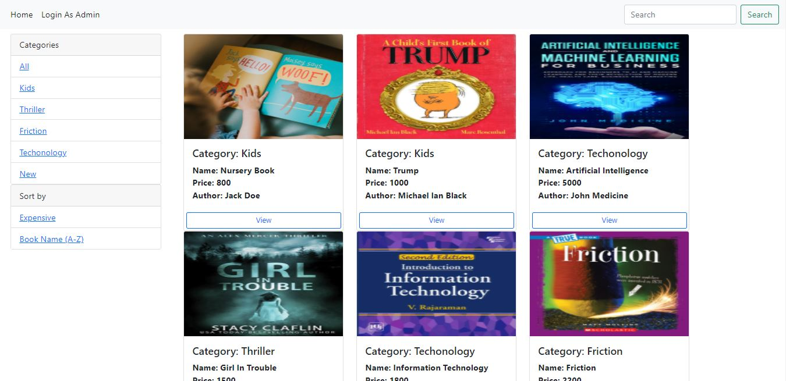
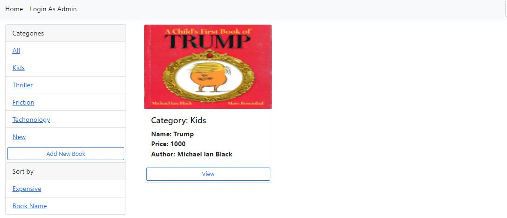
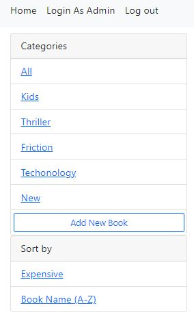
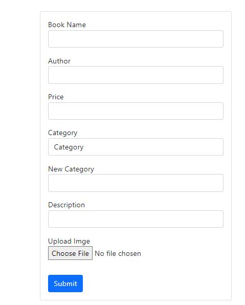

<h3>Online Book Store</h3>

<h2>Introduction</h2>
 Django application where user can view books of different categories and can search books whereas admin must logged in into the system to add categories and books. 

<h2>Features</h2>
 * Normal User can view different books and filter books with categories. 
 * Normal User can search particular books and can sort book according to price and in alphabetic order. 
 * Admin must logged in into the system to add new categories and books in the system 

<h1>Output of the project</h1>

<h3>View for normal user</h3>
  

 
Normal user can only search, view and filter available books according to categories or according to price. 

<h3> After Admin Login</h3>
  

 
Whereas after admin login there is feature called 'Add New Book' where admin can add books and categories in the system.

